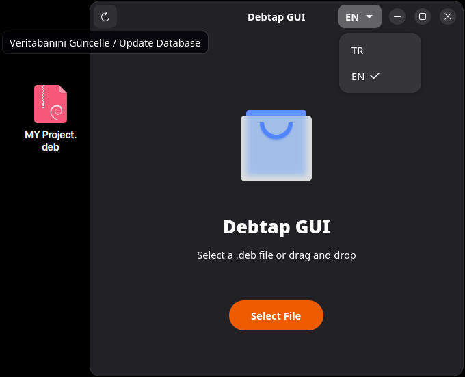
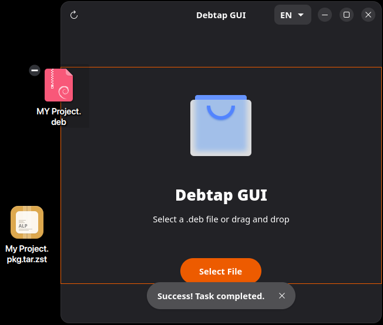

# Debtap GUI GTK

A modern GTK4/Libadwaita GUI for debtap to convert .deb packages into Arch Linux packages.

## Screenshots

### Before


### After


## Features
* Modern GTK4 UI with Libadwaita.
* Drag and drop support.
* Automatic terminal detection (Konsole, GNOME Terminal, Alacritty, etc.).
* 12 language support.
* Detailed settings menu.
* Debtap Update menu.


## Installation
This package is available on **AUR**. You can install it using an AUR helper like `yay`:

```bash
yay -S debtap-gui-gtk
