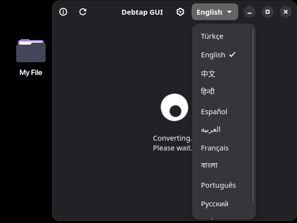
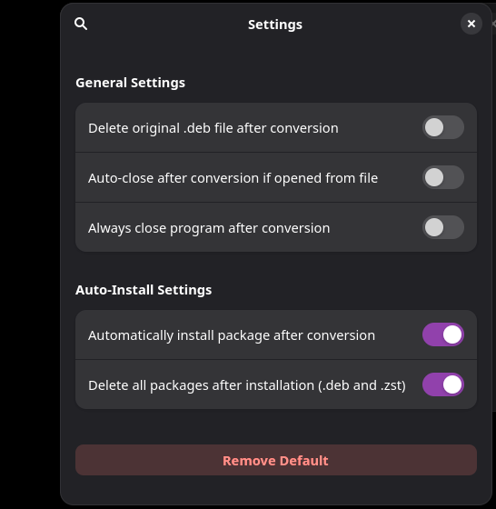
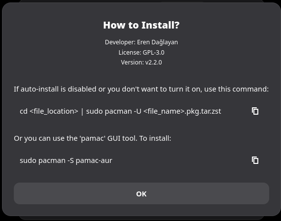
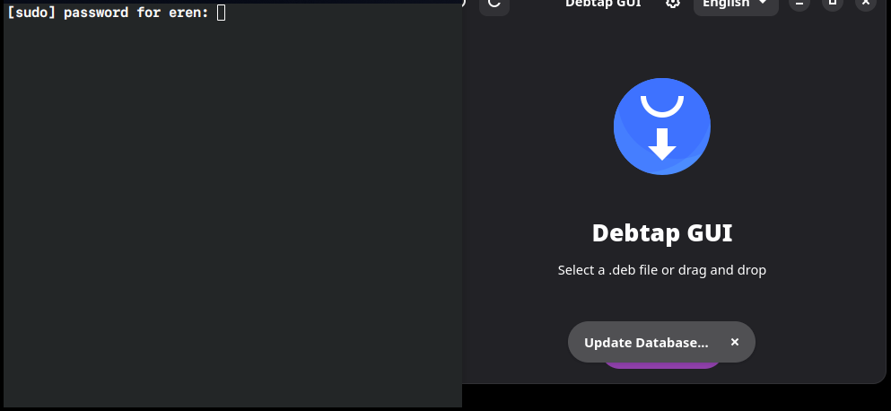

# Debtap GUI GTK

A modern GTK4/Libadwaita GUI for debtap to convert .deb packages into Arch Linux packages.

## Features
* Modern GTK4 UI with Libadwaita.
* Drag and drop support.
* Automatic terminal detection (Konsole, GNOME Terminal, Alacritty, etc.).
* 12 language support.
* Detailed settings menu.
* Debtap Update menu.
* I don't need to open the application.(if you press the .deb file, it opens directly by default)

## Screenshots

### Before


### Now


### After


### Setting Menu


### Information Menu


### Update Menu


## Features
* Modern GTK4 UI with Libadwaita.
* Drag and drop support.
* Automatic terminal detection (Konsole, GNOME Terminal, Alacritty, etc.).
* 12 language support.
* Detailed settings menu.
* Debtap Update menu.
* I don't need to open the application.(if you press the .deb file, it opens directly by default)


## Installation
This package is available on **AUR**. You can install it using an AUR helper like `yay`:

```bash
yay -S debtap-gui-gtk
